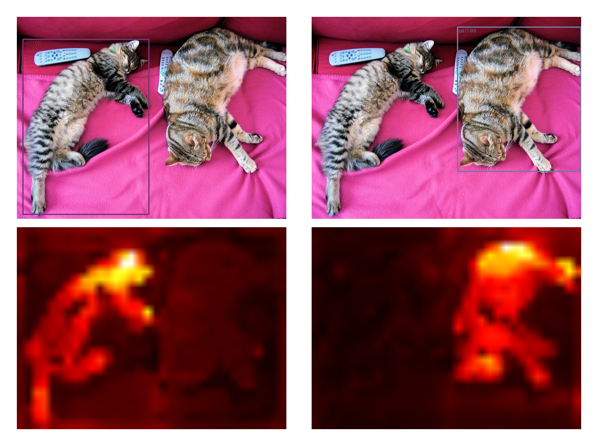

# XAI-DETR: Explainable AI (XAI) tool for Detection Transformers (DETR). 

- The method for generating relevance maps is based on ["Generic Attention-model Explainability for Interpreting Bi-Modal and Encoder-Decoder Transformers"](https://arxiv.org/abs/2103.15679) by H. Chefer, et al.

- Integrated with Hugging Face's DETR model. For more information, see [here](https://huggingface.co/docs/transformers/main/en/model_doc/detr).

-  The `insertion` and `deletion` evaluations are inspired from [RISE](https://arxiv.org/abs/1806.07421) paper. Instead of perturbing the input image space, the tool perturbs in the image token space to evaluate the faithfulness of the explanations.

## Installation

### Step-by-Step Instructions:

1. **Install CUDA Toolkit and Pytorch**:
    - Only if you have a compatible NVIDIA GPU and want to use CUDA-accelerated PyTorch. Visit the [CUDA Toolkit Archive](https://developer.nvidia.com/cuda-toolkit-archive) page.
    - The `environment.yml` file contains the Pytorch library 2.3.1 configured with CUDA 11.8. The installation of Pytorch was done according to the instructions on the [Pytorch website](https://pytorch.org/get-started/locally/).

2. **Create a new conda environment with required libraries**:
    - The environment was created with Anaconda but all the other libraries except Pytorch were installed using pip.
    ```bash
    conda env create -f environment.yml
    ```

## How to use

-  Check out the `tutorial.ipynb` notebook for a quick start to see how to use the tool.

## Scripts

- Use `scripts/main.py` to run the tool on a set of images. 
- To configure the script, edit the `scripts/config.yaml` file.
-  For each image in the folder, the script will generate a directory at `output_dir/image_name` containing an `explanations.pkl` file where the data is stored and a `logs` directory containing the tensorboard logs for visualizing the explanation and its evaluations.

## Results

- The following image shows the results of the XAI-DETR tool on a sample image.
- A relevance map is created for each detection (left cat and right cat).

